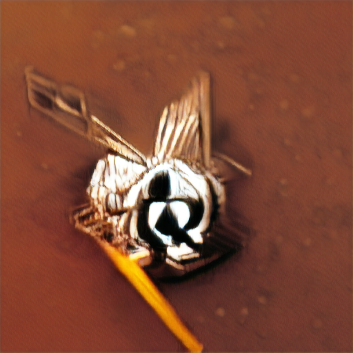
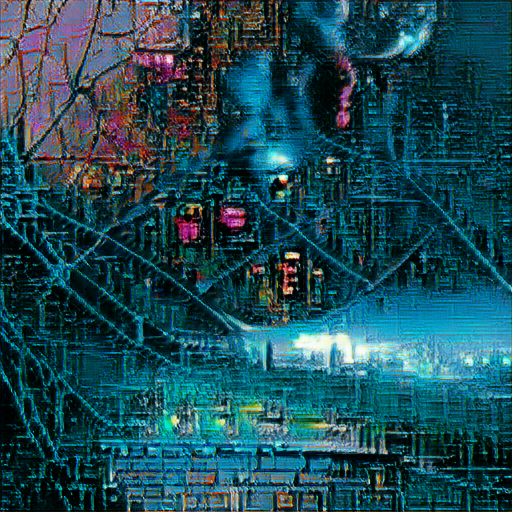
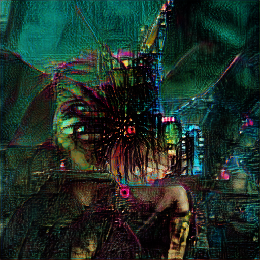
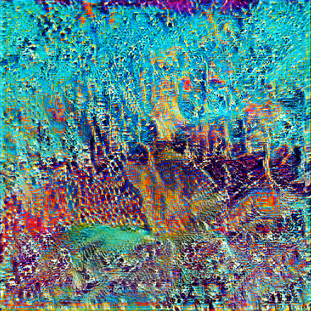
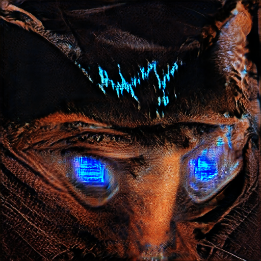
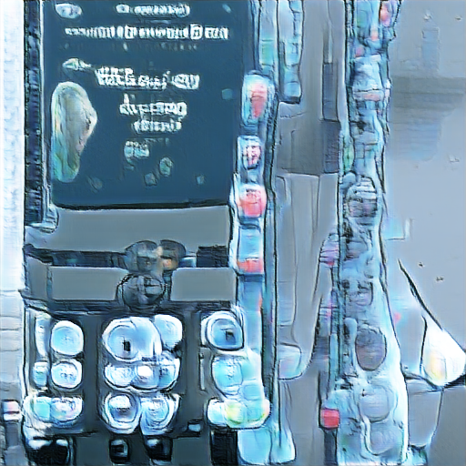
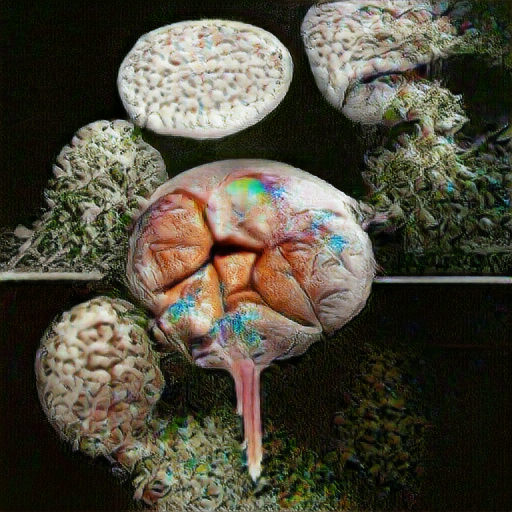
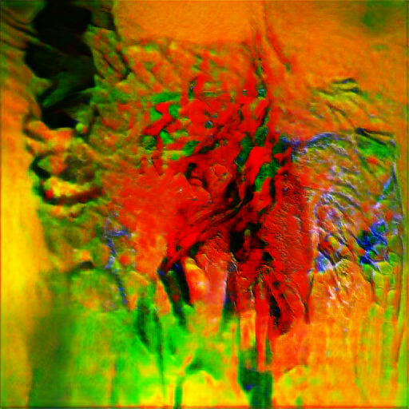

  
  AI Weirdness had another [great post](https://aiweirdness.com/post/641389107563626496/searching-for-bernie) using [Big Sleep](https://github.com/lucidrains/big-sleep) which uses a neural net to steer another neural net towards a given prompt. Again, I am amazed at how much easier it has become to play with these, from the second link you can go into their Google Colab workbook and drive a properly set-up virtual machine in seconds. For free.

The first thing I asked for was "an Operational Researcher". I got this:
  

Which appears to be some sort of fly on a pencil, and an awesome album cover. 

I was given access to a gigantic neural net [^1] on Google's hardware, and I've been reading/watching bits of William Gibson, the father of Cyberpunk, recently. [^2] So I asked it to draw me a "neuromancer":

Which ought to be the cover for a Gibson novel, or a Doctorow/Stross novel. Or maybe a Gary Numan album, possibly The Network.

One very useful feature of the colab notebook is that you can choose the random seed. This should improve reproducibility. It also showed me how lucky I was to get that image on my first run, many seeds produced garbage. 

One seed was doing well:

but eventually fell into feature collapse:

Which still look like *awesome* album covers.

After asking for "neuromancer", "technomancer" came to mind, reminding me of a sysadmin friend. Seed 0 was definitely a Numan album cover. 

Seed 3 showed promise, but collapsed before too long:

Since it was giving me trippy images, I gave it the prompt "your brain on drugs". It delivered feature collapse.

Before feature collapse:

After feature collapse:

## Sideways discussion on copyright

Now the main tricky thing is to work out what copyright details to write for the "images/" folder for this post. In England & Wales the creator is automatically granted a copyright once their creative work is in a tangible form. Digital counts. 

Who created these art?

Did the authors of BigGan create every image it has spat out, by writing its code? One level lower, did is BigGan doing anything bigger than really fancy filters to a few Gigabytes of uncredited photos? Does the author of an Instagram filter get copyright over your selfies?

Should BigGan/Big Sleep get legal personhood and assigned copyright? No. Neural nets are not biology, and even if they were BG is smaller than a hamster, and the [monkey selfie](https://en.wikipedia.org/wiki/Monkey_selfie_copyright_dispute)
ruled against the monkey. 

Is what I did sufficient to constitute "creative work"? I trashed at least twice as many photos as I've chosen to share for this post. That feels incorrect, I fed a program some potentially interesting inputs, about 50% of what came out was interesting and I deleted the rest. 

Where I've given the prompts & seeds this is entirely reproducible. "Technomancer seed 3 300 epochs" would likely be too small to qualify as a distinct copyrighted work, but you can go to that colab workbook and should get the same image. 

This is already a semi-serious issue - the explosion of "keep calm & ..." merchandise came from very shallow algorithms connected to print-on-demand services. We only noticed when [Amazon pulled the plug on really offensive designs](https://www.channel4.com/news/amazon-removes-offensive-keep-calm-and-hit-her-t-shirts). These were fly-by-night operations, spin up a design, sell it, delete it if it doesn't sell. They were moving too fast to notice what their programs had spat out, and definitely moving too fast to sue each other for copyright infringement. But could they have? 

UK Copyright law was founded in the context of the printing press and was extended to a death-plus system to harmonise with a trading bloc we just left. A computer was a lady with a pencil and an abacus, and making a commercial copy involved machinery bigger than some flats I've lived in. d

[^1]: but still smaller than a hamster.
[^2]: Opening crawl for Johnny Mnemonic (movie) starts "Second decade of the 21st century. Corporations rule. The world is threatened by a new plague". Cyberpunk isn't supposed to be *that* prophetic.