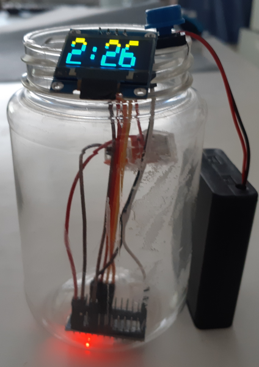

```{r setup, include=FALSE}
knitr::opts_chunk$set(
  echo = TRUE,
  message = FALSE,
  warning = FALSE
)
library(tidyverse)
library(janitor)
library(plotly)

theme_set(ggthemes::theme_tufte())

```

When I compared the heart rate sensors on my watch and on my chest strap, I mentioned a work-in-progress gym clock. I've overcome one major bug, but it's definitely not *finished*. 

In the background, I've tweaked a few things. This project made me want to talk about non-R projects, and I'm trying to make this blog suitable for submission to R-bloggers, which means that the RSS feed for the R category needs to work. I've broken and fixed the site at least twice for this reason. 

# The PB clock

## Motivation

I saw crossfit-style gym clocks selling for ~£100, which lead to me giving the Yorkshire Exclamation "Ow Much?!". I've used <£10 of parts, but easily >£100 of time. But playing with microelectronics is a hobby, and we don't do hobbies to save money, but for the enjoyment - ask any knitter/spinner.

The main _need_ of this project was "display a 3-minute timer". So some sort of screen, a single button, a power supply, and a brain. I grabbed an arduino as the brain since I had a few in my electronics box. 

I don't mind that it only does 3 minutes. That minimises my urge to endlessly tinker.

I'd use my phone, but I don't like covering my phone in lifting/climbing chalk, and I'm afraid of dropping my phone when tired. 1 Physical button is good.

## Current Iteration



For the blog I've thrown the Arduino-C source code to [its own Github Repo](https://github.com/jimr1603/PB_clock), rather than have a giant blob of not-very-useful text. This is a decent example of blogging improving a project - I've neglected version control, and I can use GitHub issues/project board to look at new features.

I'm now calling it the PB clock because:

- the plastic jar used to hold peanut powder (peanut butter, without the fat).
- PB = Personal Best; usually your Personal Best lift. (Heaviest, most repetitions, ...)

## On a minimal-viable-product

{width=50% height=50%}

I got the project to that stage, then started field-testing it - I took it to the home gym. 

Every step of this has been "make some changes, check it works on the bench, then take it to the gym/garage and see how it does". 
There's plenty more I want to do to this project, but this model of "get it back in the garage doing its job ASAP" is nice. With this model it's getting used now, rather than sitting at the bottom of the projects drawer waiting for a rainy day. It also means some shortcuts aren't great, but it works so whatever. 

For example:

```{}
String clockTime = "";

  clockTime = clockTime + minutes + ":";
  if(seconds <= 9){
    clockTime += "0";
    clockTime += seconds;
  }else{
    clockTime +=  seconds;
  }

```

I should be working with a char* array there, but pointers hurt my head. This works, and even if I've unnecessarily included the String library with this code, there's still plenty of space on the chip. 

## Field Debugging

The MVP approach showed me a problem with one of the components, which for ages I thought was a problem in code. 

I would come to the clock expecting it to be flashing "00:00", but the time had gone up! This happened on the time-scale of a workout (45-ish minutes). I didn't have the patience to watch it at the bench looking for the reset. 

I thought that I'd got the debounce wrong on the button - so I kept increasing how long I needed to press the reset button to reset the timer. 

Eventually I added a debug-flag LED, pictured in the breadboard version above. In R I might have:

```{r, eval=FALSE}
function_that_does_not_work = function(foo, bar, bang){
  message("Foo, bar, bang:")
  message(list(foo, bar, bang))
  ...
}

```

in a function that isn't behaving. Similarly throwing ` console.log ` around in JavaScript to check why something isn't doing what you expect it to do.

In this case, the unexpected behaviour was the timer resetting. I thought it was the button triggering too easily, so once the button had been pressed & the timer reset, that green LED would stay on. It would stay on until the Arduino reset, for example through a power interruption.

The green LED went out when the clock unexpectedly reset - so the problem was not my button code that I've now set to be too insensitive, but the power supply I was using. I think the USB power blocks I had to hand didn't expect something as small as this would be connected. 

The current iteration has 4x AA batteries, in the black box in the picture. 

## Onwards


1. Take this list and turn it into a TODO list on GitHub.
2. Make the reset button less sensitive.
3. Refresh the clock when the timer resets. 
4. Make holes in the case for the components, glue/tape the components.
5. Possibly before (4), consider [blinkenlights](https://en.wikipedia.org/wiki/Blinkenlights). 
6. Consider making a second, maybe when current jar has been emptied, so one can be in the gym while the other is on the bench. 