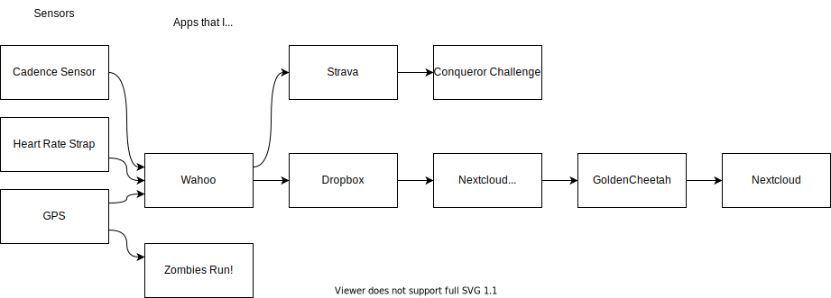

```{r setup, include=FALSE}
knitr::opts_chunk$set(
  echo = TRUE,
  message = FALSE,
  warning = FALSE
)
library(tidyverse)
library(trackeR)

theme_set(ggthemes::theme_tufte())

```

# Leeds-Bradford is a bit hilly

This came up in conversation - to go any direction on my bike I have to go up or down a hill, and if I go down a hill I have to go up to get back up the hill. 

# Data pipelines

I have a _bit_ of a data pipeline going on that ended with me having a nice folder of json files that several R packages are happy to deal with. 



There's a cadence sensor on my shoe [^1], the chest strap has made appearances in other posts, and GPS lies on my phone. I activate Wahoo every trip as the main data collector, but Zombies Run! is there because I'm more motivated to do cardio if there's a game element.

I don't directly use Strava, but it accepts data from everything and will give data to everything. 

Wahoo spits out GPX files, which are awful to work with. So Wahoo has been asked nicely to give the files to Dropbox, Dropbox gives them to my home server, and my home server waits for me to open [GoldenCheetah](https://www.goldencheetah.org/). 

GC is absolute overkill for what I'm using it for. At most, I'm getting the paid features from Strava out of it. The main user is clearly someone who is training bike seriously. BUT, it converts everything in the background to a sensible json format. 

GC is also uploading to an open data project, so at least there's someone way below athlete level making the data more representative.

Strava passes the data to [Conqueror Challenge](https://www.theconqueror.events/) where a little icon is moving around the Iceland Ring Road quite slowly. But my little virtual me sends me postcards, and I get a medal at the end. Did I mention that I really like gamified incentives?


[^1]: funny story, it glitched hard when I had it mounted 90 degrees in the wrong direction. I don't know why the app was happy reporting that I achieved 4500 RPM.


# Data Analysis

To hide where I keep my directory of json, I've done one bit of summary analysis before throwing a csv/spreadsheet into this dir.

In this case trackeR is happy reading the GoldenCheetah json files, but I've also done some bits with purrr/jsonlite as relevant. It all depends on how I'm looking at the data.

```{r eval=FALSE, include=TRUE}

activities = read_directory($CENSORED, 
                            parallel = TRUE)
summary(activities) %>% 
    as_tibble() %>% 
    mutate(date = lubridate::as_date(sessionStart, "day")) %>% 
    select(date, total_elevation_gain, durationMoving) %>% 
  filter(date >= as.Date("2021-05-01")) %>% 
  write_csv("cycling-summary.csv")

```

```{r}
elevation = read_csv("cycling-summary.csv") %>% 
  filter(durationMoving > 1) # Buggy records

elevation %>% 
  filter(!is.na(total_elevation_gain)) %>% 
  mutate(cumulative_elevation = cumsum(total_elevation_gain)) %>% 
  ggplot(aes(x=date, y=cumulative_elevation))  + geom_step() +
  scale_y_continuous(labels = ~scales::comma(., suffix = "m"))

```

[Wolfram Alpha is my go-to for comparing unusual measurements](https://www.wolframalpha.com/input/?i=12000+m+height)

```{r}
elevation = read_csv("cycling-summary.csv")

elevation %>% 
  filter(!is.na(total_elevation_gain)) %>% 
  mutate(cumulative_elevation = cumsum(total_elevation_gain)) %>% 
  ggplot(aes(x=date, y=cumulative_elevation))  + geom_step() +
  scale_y_continuous(labels = ~scales::comma(., suffix = "m")) +
  geom_hline(yintercept = 8550) +
  geom_label(aes(as.Date("2021-09-14"), 8550, label = "Everest")) + 
  geom_hline(yintercept = 1345) +
  geom_label(aes(as.Date("2021-09-14"), 1345, label = "Ben Nevis")) 
```

Some people do an Everest in 1 day/awake cycle, it took me 2.5 months.

More relevant for the title is elevation gain in a single session:

```{r}
elevation %>% 
  ggplot(aes(x=total_elevation_gain)) + geom_density()
```

Or over time:

```{r}
elevation %>% 
  ggplot(aes(x=date, y=total_elevation_gain)) + geom_point() 
```

```{r}
elevation %>% 
  mutate(avg_climb = total_elevation_gain/durationMoving) %>% 
  ggplot(aes(y=avg_climb, x=date)) + geom_point() 
```

Huh, I thought I was pushing myself a bit more, but it looks like I've picked a total climb and avg climbing speed I'm happy with and settled into it.

## With apologies to Joy Division...

Also I'm borrowing a few ggplot settings from [DataWookie](https://www.r-bloggers.com/2019/07/recreating-unknown-pleasures-graphic/)

```{r}
library(ggridges)
elevation %>% 
  mutate(month = lubridate::floor_date(date, "month")) %>% 
  ggplot(aes(x=total_elevation_gain, y=month, group=month)) + 
  geom_density_ridges(                 
    scale= 1,
                 size = 1,
                 fill = "black",
                 colour = "white") +
    theme_void() +
  theme(
    panel.background = element_rect(fill = "black"),
    plot.background = element_rect(fill = "black", color = "black"),
  )
```

