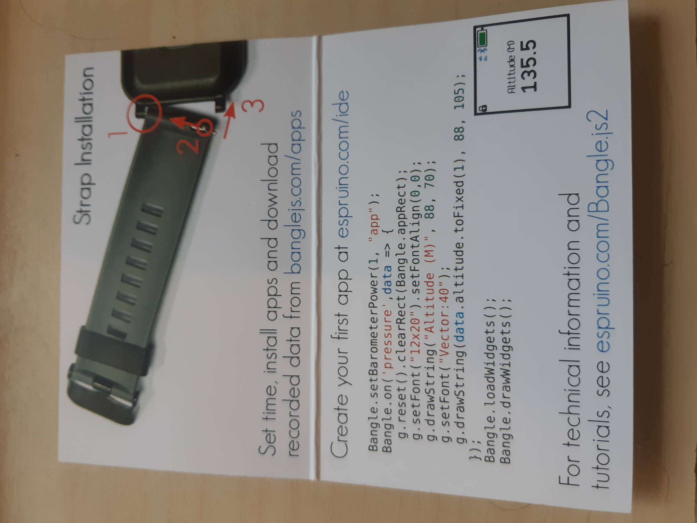
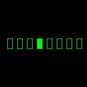

My [Bangle.js 2](https://banglejs.com/) arrived. It is unashemedly a watch for hackers - the instruction card has code for the first program right next to how to attach the strap:



I'll admit that's pretty niche but me and [2000 other people thought it was worth preordering via kickstarter](https://www.kickstarter.com/projects/gfw/banglejs-2-the-open-smart-watch). 


The [first app tutorial](https://www.espruino.com/Bangle.js+First+App) is so damn close to the gym clock that I borrowed the code and adapted it for my needs - first was making the clock reset even if I hit the button while it's still counting down.


```{js}
var counter;
var counterInterval;

function draw_bin_array(binary, x, y, width){
  g.setBgColor(0,0,0);
  g.clear();
  g.setColor(0,1,0);
 for (let i = 0; i< binary.length; i++){
   let x1 = x + width*i+width/2;
   let x2 = x + width*(i+1);
   
   if (binary[i]){
     g.fillRect(x1, y, x2, y+width);
   }
   else{
      g.drawRect(x1, y, x2, y+width);

   }
 }
  //g.dump(); This line generated 18 images for my blog :D
}

function dec_to_bin_array(number, power){
  let value = [];
  let remainder = number;
  for (let i = power; i >= 0; i--){
    if(remainder >= Math.pow(2, i)){
      remainder -= Math.pow(2, i);
      value[power-i] = true;
    }
    else{
      value[power-i] = false;
    }
  }
  return(value);
}


function outOfTime() {
  if (counterInterval) return;
  E.showMessage("Drop and give me 10100", "Gym Timer");
  Bangle.buzz();
  Bangle.beep(200, 4000)
    .then(() => new Promise(resolve => setTimeout(resolve,200)))
    .then(() => Bangle.beep(200, 3000));
  // again, 10 secs later
  //setTimeout(outOfTime, 10000);
}


function countDown(){
  let bin_counter = dec_to_bin_array(counter, 7);
  draw_bin_array(bin_counter, 5, 78, 20);
  
  setWatch(startTimer, (process.env.HWVERSION==2) ? BTN1 : BTN2);

  
  counter--;
    if (counter<=0) {
    clearInterval(counterInterval);
    counterInterval = undefined;
    outOfTime();
    return;
  }
}

function startTimer() {
  counter = 180;
  
  if (!counterInterval){
    countDown();
    counterInterval = setInterval(countDown, 1000);
  }
}

startTimer();


```

I was discussing binary with some mates on FB, remembered how I used to have a binary watch, and added a couple of functions to turn the counter into a binary counter. 

This is JavaScript, which I'm less familiar with, but it's easy enough to get started. 

Part of the countdown follows:



Those images were rendered by the actual watch - I was going to do a screen record with [the emulator](https://www.espruino.com/ide/emu/emu_banglejs2.html) but I spotted a `dump` screen command and got it to pass a bunch of images across bluetooth! ImageMagick and GifSki helped me turn 17 bitmaps into that gif. 

Currently 180 seconds (3 minutes) is hardcoded, and I will be looking to throw that at the settings module in the general watch.

This was not realistically an option for gym clock v1. I was running a Samsung watch, which runs their own Tizen OS. Setting up the proprietary development environment was a PITA. 

Bangle on the other hand, is like "hey, you want to run this in an emulator, throw it into temporary space on the actual watch, throw it into storage on the watch? That's all super easy!". 

I might do more bangle posts - I've some work in progress adding sunrise and sunset to my watchface, but it's not polished enough to present just yet. 