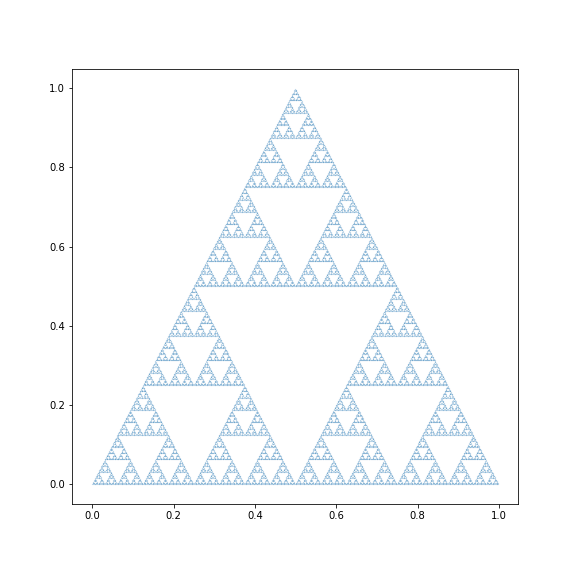

I'm revisiting Python while I'm playing with not-R. It's been a while.

Since then;

- the transition from 2.x to 3.x is mostly a settled matter.
- pandas/numpy have matured, taking inspiration from the vectorised operations in R.
- I've stopped using `<-` assignment in R, in favour of `=`. 
- pandas has started looking at doing a similar pipe as I've seen in JS.
- RStudio have rebranded, partially to court Pythonistas.
- R Markdown support for Python has improved.

I was plugging through Math for Python, where I came across our familiar chaos game. 
Since last time I'd been thinking about taking both/all paths, rather than randomly selecting a path. 
In the 3-node case, that means that the number of points triples every iteration, so I'll start with just one point.

I was also looking at the book by the pandas author, and was happy to see my nice vectorised arrays in numpy :)

Moreso than usual, this code is clunky as hell. I'm feeling around and finding my feet here, so it's going to be hella ugly.

The following snippet comes from a notebook I was working in VSCode/Jupyter. I'm not getting RStudio to play nicely with Python today, at least not while I'm still in RMarkdown rather than Quatro.[^1]

```{python eval=FALSE, include=TRUE}
import matplotlib.pyplot as plt
import numpy as np
import math

def transform_1(x, y):
    x = 0.5 * x
    y = 0.5 * y
    return x,y
def transform_2(x, y):
    x = 0.5*x + 0.5
    y = 0.5*y + 0.5
    return x,y

def transform_3(x,y):
    x = 0.5*x+1
    y=0.5*y
    return x,y

x = np.array([0])
y = np.array([0])


while(len(x) < 1e4):
    t1x, t1y = transform_1(x,y)
    t2x, t2y = transform_2(x,y)
    t3x, t3y = transform_3(x,y)

    x = np.append(t1x,t2x)
    x = np.append(x, t3x)

    y = np.append(t1y, t2y)
    y = np.append(y, t3y)

plt.scatter(x/2,y, s=0.01)
```



[^1]: The while loop took forever to run in RStudio, barely any time in Jupyter. Likely R is asking Reticulate to do each iteration of the loop, taking the objects back, and sending them back across? Or something isn't set up on this machine right yet. 